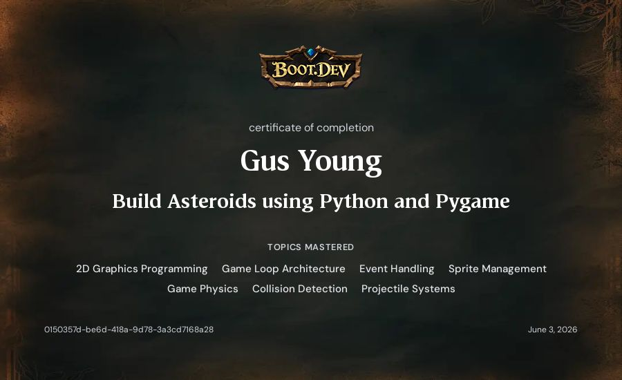

# Asteroids

A faithful recreation of the classic Asteroids arcade game, built with Python and pygame.

 

## Features

- Player ship with smooth rotation and thrust-based movement
- Asteroids that spawn from screen edges and split into smaller fragments when shot
- Bullet cooldown to prevent spamming
- Off-screen bullet culling to keep performance clean
- Accurate circle-based collision detection

## Controls

| Key | Action |
|-----|--------|
| `W` | Thrust forward |
| `S` | Thrust backward |
| `A` | Rotate left |
| `D` | Rotate right |
| `Space` | Shoot |

## Getting Started

**Requirements:** Python 3.12+, [uv](https://github.com/astral-sh/uv)

```bash
git clone https://github.com/gusyoung/Asteroid.git
cd Asteroid
uv run main.py
```

## Project Structure

```
├── main.py           # Game loop and collision handling
├── player.py         # Player ship logic
├── asteroid.py       # Asteroid movement and splitting
├── asteroidfield.py  # Asteroid spawner
├── shot.py           # Bullet logic
├── circleshape.py    # Shared base class for all game objects
└── constants.py      # Tuning constants
```

## Certificate of Completion

Built as part of the [Boot.dev](https://boot.dev) backend development curriculum.


